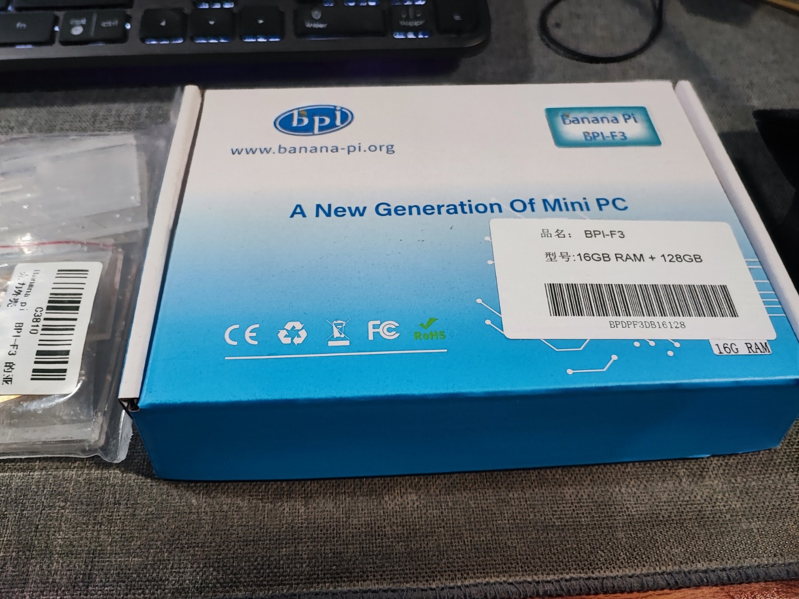
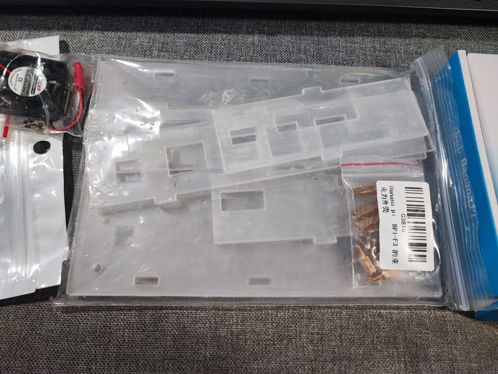
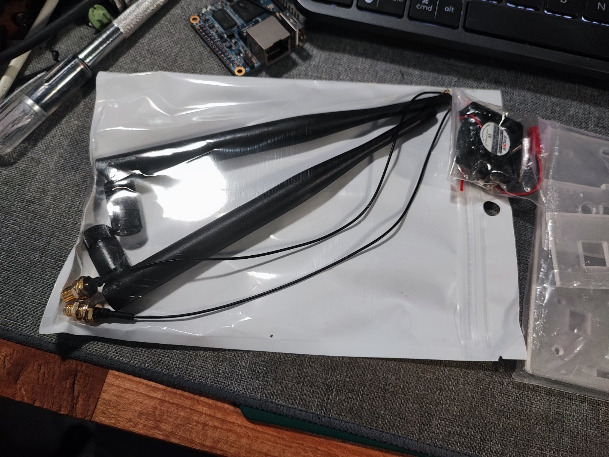
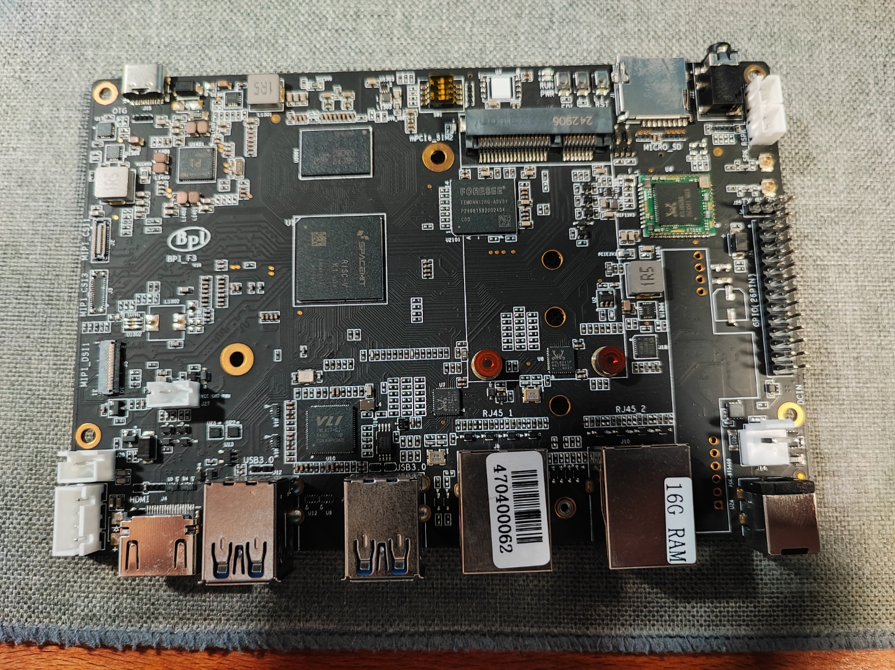
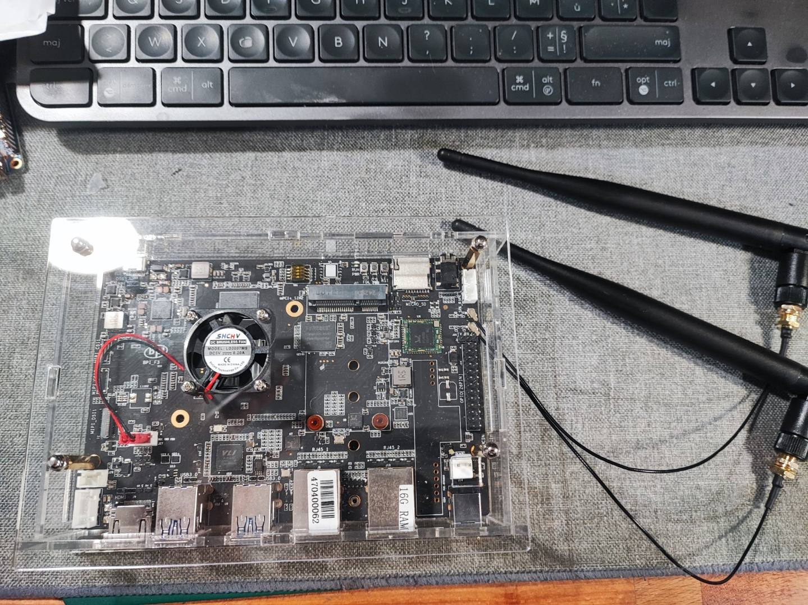

# Unboxing and Hardware Overview

**Date**: 2025-11-30
**Status**: ✅ Completed

This guide documents the unboxing process and initial hardware inspection of the Banana Pi F3 RISC-V64 single-board computer.

## Package Contents

The Banana Pi F3 arrives in a compact blue box labeled "A New Generation Of Mini PC" with the following specifications clearly marked on the box:

- **Model**: BPI-F3
- **Configuration**: 16GB RAM + 128GB
- **Website**: www.banana-pi.org

*Banana Pi F3 retail packaging*

### What's Inside

Opening the box reveals:

1. **Banana Pi F3 board** - The main single-board computer
2. **Plexiglass/acrylic case** - Clear protective enclosure with mounting hardware
3. **Active cooling fan** - Small 30mm fan with mounting brackets
4. **Standoffs and screws** - Brass standoffs and mounting hardware for case assembly
5. **WiFi antennas** (2x) - External antennas with U.FL connectors
6. **Documentation** - Quick start guide or warranty card

*All components laid out - plexiglass case, fan, antennas, hardware*

*Close-up of included antennas, fan assembly, and mounting hardware*

## Hardware Specifications

### Banana Pi F3 Board Overview

The BPI-F3 features a black PCB with clearly labeled components:

- **SoC**: SpacemiT K1 (RISC-V64, 8 cores)
- **RAM**: 16GB LPDDR4
- **Storage**: 128GB eMMC (onboard)
- **Architecture**: RV64GC (RISC-V 64-bit with extensions)

### Port Layout

Examining the board reveals the following ports and connectors:

**Left Side (viewed from above):**
- 2x USB 3.0 Type-A ports (blue)
- 1x microSD card slot
- Serial debug header (4-pin)

**Right Side:**
- Gigabit Ethernet port (RJ45)
- HDMI output
- USB-C power input
- GPIO header (40-pin)

**Top:**
- 2x WiFi antenna connectors (U.FL)
- M.2 slot (for NVMe/WiFi)

*Top view showing ports, GPIO header, and antenna connectors*

## Case Assembly

The included plexiglass case provides:
- Protection from dust and accidental contact
- Access to all ports while mounted
- Mounting points for the active cooling fan
- Standoffs to elevate the board for airflow

### Assembly Process

1. **Install standoffs**: Screw brass standoffs into the board mounting holes
2. **Mount the board**: Place board into bottom half of case, align with standoffs
3. **Attach the fan**: Mount the 30mm fan to the designated bracket (typically above the SoC)
4. **Connect fan power**: Attach fan to the board's fan header (if present, otherwise use GPIO)
5. **Attach antennas**: Connect WiFi antennas to the U.FL connectors
6. **Close the case**: Attach the top cover and secure with screws

*Banana Pi F3 mounted in case with fan installed and antennas attached*

## Initial Observations

### Build Quality
- Solid PCB construction with clear component labeling
- Professional appearance with proper shielding
- Well-designed case with good airflow potential

### Size and Form Factor
- Compact footprint similar to Raspberry Pi 4
- Heavier than expected due to heat spreaders and eMMC
- Case adds minimal bulk while providing good protection

### Cooling Solution
- Active fan included (not always standard with SBCs)
- Fan appears to be 30mm, 5V DC
- Mounting allows airflow directly over SoC

## Hardware Verification Checklist

Before proceeding to software installation, verify:

- [x] Board is free from physical damage
- [x] All ports are intact and accessible
- [x] RAM chips are properly seated (factory installed)
- [x] eMMC is present (factory installed)
- [x] Case fits properly with board mounted
- [x] Fan spins freely and is properly oriented
- [x] Antennas are securely attached
- [x] No loose components or debris in the case

## What's Not Included (You'll Need)

The following items are **not included** and must be obtained separately:

1. **Power supply** - USB-C, 5V/3A minimum (5V/4A or 5V/5A recommended for stability)
2. **Ethernet cable** - For initial network setup (WiFi can be configured later)
3. **microSD card** - 16GB+ Class 10 or better (for initial Armbian boot before eMMC transfer)
4. **Computer with SD card reader** - To prepare the bootable SD card
5. **HDMI cable and monitor** - Optional for console access (can use SSH instead)
6. **USB keyboard** - Optional for console access (can use SSH instead)

## Key Observations for GitHub Runner Use

This hardware is well-suited for a GitHub Actions runner:

**Strengths:**
- **16GB RAM** - Sufficient for Docker builds and parallel compilation
- **128GB eMMC** - Fast storage for build artifacts and Docker images
- **8-core CPU** - Good for parallel compilation (make -j8)
- **Gigabit Ethernet** - Fast network for pulling Docker base images
- **Active cooling** - Prevents thermal throttling during long builds
- **RISC-V64 architecture** - Native builds for this emerging platform

**Considerations:**
- **eMMC endurance** - Consider wear leveling for CI/CD workloads (build cache churns storage)
- **Power requirements** - Need stable 5V supply for reliability
- **Cooling** - Fan may need replacement eventually (wear item)

## Next Steps

Now that the hardware is unboxed, inspected, and assembled:

1. ✅ **Hardware assembled and verified**
2. ➡️ **Next**: [Download Armbian image](02-armbian-download.md)
3. **Then**: Prepare SD card and perform first boot

## Photos Reference

All photos from this unboxing are stored in `/media/`:
- `IMG_20251130_201247.jpg` - Box packaging
- `IMG_20251130_201249.jpg` - Unboxed contents overview
- `IMG_20251130_201251.jpg` - Components detail
- `IMG_20251130_201546.jpg` - Board top view
- `IMG_20251130_213801.jpg` - Assembled in case with fan

---

**Completion Status**: Hardware unboxed and ready for software installation
**Time Required**: ~30 minutes (unboxing + case assembly)
**Next Guide**: [02-armbian-download.md](02-armbian-download.md)
